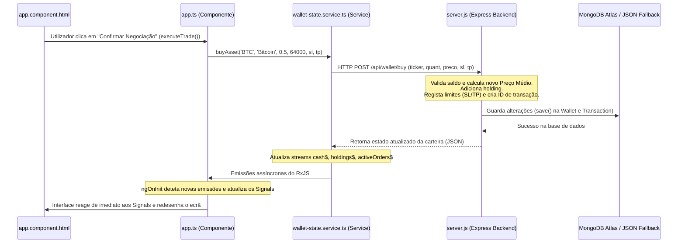

# Guia de Estudo: Descodificando o Projeto Simão's Broker

Olá! Seja bem-vindo ao teu guia de estudo pessoal. 🎓✨
Se estás a preparar-te para apresentar este projeto ao teu professor, ou se simplesmente queres dominar o código que escrevemos, vieste ao sítio certo. Vamos analisar cada parte do projeto juntos, passo a passo, de forma simples e direta, como se estivéssemos a estudar numa tarde de café.

---

## 1. O Mapa do Tesouro: Como as Peças Encaixam

Agora o nosso projeto está dividido em duas partes independentes e profissionais: o **Frontend (Angular)** e o **Backend (Node.js/Express/MongoDB)**.

1. **O Frontend Angular (`portfolio-app`)**:
   * **[live-market.service.ts](file:///c:/Users/Huawei/OneDrive/Ambiente%20de%20Trabalho/TP3/portfolio-app/src/app/services/live-market.service.ts)**: Controla a simulação de preços em tempo real no browser.
   * **[wallet-state.service.ts](file:///c:/Users/Huawei/OneDrive/Ambiente%20de%20Trabalho/TP3/portfolio-app/src/app/services/wallet-state.service.ts)**: Deixou de fazer cálculos locais! Agora limita-se a fazer chamadas HTTP à API do backend para ler e gravar dados.
   * **[app.ts](file:///c:/Users/Huawei/OneDrive/Ambiente%20de%20Trabalho/TP3/portfolio-app/src/app/app.ts)**: Mapeia as respostas HTTP em Signals do Angular para renderizar a interface de trading e o gráfico SVG de forma ultra-reativa.
   * **[app.component.html](file:///c:/Users/Huawei/OneDrive/Ambiente%20de%20Trabalho/TP3/portfolio-app/src/app/app.component.html)** & **[styles.css](file:///c:/Users/Huawei/OneDrive/Ambiente%20de%20Trabalho/TP3/portfolio-app/src/styles.css)**: Definem a estrutura visual e os estilos dinâmicos baseados no *dark mode glassmorphism*.

2. **O Backend Express & MongoDB (`portfolio-backend`)**:
   * **[server.js](file:///c:/Users/Huawei/OneDrive/Ambiente%20de%20Trabalho/TP3/portfolio-backend/server.js)**: O cérebro do servidor. Contém os esquemas do banco de dados Mongoose, gere os pedidos HTTP que o Angular faz, processa as transações financeiras com segurança e controla a lógica de gravação no MongoDB Atlas. Também tem um mecanismo de segurança integrado (fallback) que grava num ficheiro JSON local se a ligação ao MongoDB Atlas falhar.
   * **[.env](file:///c:/Users/Huawei/OneDrive/Ambiente%20de%20Trabalho/TP3/portfolio-backend/.env)**: Guarda as configurações confidenciais (porta do servidor e link do MongoDB Atlas).

---

## 2. Signals vs RxJS Observables: O Duelo da Reatividade

Uma das perguntas mais prováveis que o teu professor poderá fazer é: *"Por que usaste RxJS Observables e Angular Signals juntos no mesmo projeto?"*

Aqui está a resposta perfeita para brilhares na resposta:

| Tecnologia | Para que serve neste projeto? | Exemplo prático no código |
| :--- | :--- | :--- |
| **RxJS Observables** (`BehaviorSubject`, `interval`) | **Eventos e Fluxos Assíncronos**: Excelente para lidar com eventos recorrentes no tempo (como o relógio que atualiza os preços de 2 em 2 segundos) e para partilhar dados entre serviços. | `interval(2000).subscribe(...)` que atualiza as cotações em background no `LiveMarketService`. |
| **Angular Signals** (`signal`, `computed`) | **Estado Síncrono da Interface**: Perfeito para o HTML ler os dados de forma super rápida e otimizada. Sempre que um Signal muda, o Angular redesenha apenas a parte exata do HTML afetada. | `activeTab = signal('negociacao')` ou o cálculo automático do património total com `totalAssetsValue = computed(...)`. |

### Como eles cooperam no nosso código?
No ficheiro **[app.ts](file:///c:/Users/Huawei/OneDrive/Ambiente%20de%20Trabalho/TP3/portfolio-app/src/app/app.ts)**, dentro do método `ngOnInit()`, nós subscrevemo-nos aos Observables dos serviços. Sempre que um novo dado é emitido pelo serviço, nós usamos o método `.set()` do Signal para atualizar a interface:

```typescript
// Copiamos os dados assíncronos do serviço para os nossos Signals locais
this.walletService.getCash().subscribe(cash => this.cash.set(cash));
this.walletService.getHoldings().subscribe(holdings => this.holdings.set(holdings));
```

---

## 3. O Caminho de uma Transação: Passo a Passo (Mapeamento de Fluxo com MongoDB)

Para perceberes como funciona a comunicação entre o teu Frontend (Angular) e o teu Backend (Express + MongoDB), vamos acompanhar uma compra de **0.5 BTC**:



1. **O clique no HTML**: O utilizador clica em comprar. O controlador **[app.ts](file:///c:/Users/Huawei/OneDrive/Ambiente%20de%20Trabalho/TP3/portfolio-app/src/app/app.ts)** capta os dados e chama o `buyAsset()` no serviço do Angular.
2. **O pedido HTTP**: O **[wallet-state.service.ts](file:///c:/Users/Huawei/OneDrive/Ambiente%20de%20Trabalho/TP3/portfolio-app/src/app/services/wallet-state.service.ts)** envia um pedido assíncrono à API do Express através do `http.post('/api/wallet/buy', data)`.
3. **O processamento no Servidor**: O Express recebe a requisição em **[server.js](file:///c:/Users/Huawei/OneDrive/Ambiente%20de%20Trabalho/TP3/portfolio-backend/server.js)**:
   * Valida se o saldo em dinheiro da carteira é suficiente.
   * Recalcula matematicamente o **Preço Médio de Compra** (ver secção 4).
   * Registra as ordens de proteção limitadas (*Stop Loss* / *Take Profit*) associando-as ao portfólio.
4. **Persistência física na BD**: O Express grava a carteira e o registo histórico da transação no **MongoDB Atlas** (ou grava no ficheiro `database-fallback.json` local caso o banco esteja inacessível).
5. **Atualização reativa**: O Express responde de volta com a carteira atualizada. O serviço do Angular capta a resposta, emite os novos valores para os seus fluxos do RxJS (`cash$`, `holdings$`, etc.), os Signals são atualizados em cadeia síncrona e a tua vista HTML redesenha-se com micro-animações dinâmicas!

---

## 4. Descodificando a Matemática do Gráfico SVG

Os gráficos no nosso projeto não usam bibliotecas externas pesadas (como Chart.js ou D3). São criados do zero usando matemática simples e elementos `<svg>` nativos do HTML. Isto dá pontos extra em exames e apresentações pela originalidade!

### Como transformamos preços em linhas no ecrã?
Olha para a função `getChartPath(history)` no ficheiro **[app.ts](file:///c:/Users/Huawei/OneDrive/Ambiente%20de%20Trabalho/TP3/portfolio-app/src/app/app.ts)**. O gráfico tem dimensões fixas no ecrã de 600px de largura por 220px de altura.

1. **Encontrar os limites**: Descobrimos o preço mínimo e máximo das últimas 30 cotações na lista (`min` e `max`).
2. **Calcular a escala**: 
   * A coordenada **X** é baseada na posição do ponto no tempo: o primeiro ponto fica no X mínimo (15px) e o último ponto no X máximo (585px).
   * A coordenada **Y** é invertida, porque no SVG a coordenada $Y = 0$ fica no **topo** do ecrã e a altura máxima fica no **fundo**. Portanto, o menor preço deve ter a maior coordenada Y (fundo) e o maior preço deve ter a menor coordenada Y (topo).
3. **A Fórmula mágica da conversão**:
   $$y = \text{Altura} - \text{Padding} - \left( \frac{\text{Preço} - \text{Preço Mínimo}}{\text{Preço Máximo} - \text{Preço Mínimo}} \times (\text{Altura} - 2 \times \text{Padding}) \right)$$
4. **Construção do Path**: Unimos estes pontos usando o comando SVG `M x1,y1 L x2,y2 L x3,y3...` (M = Mover para, L = Linha até). O navegador encarrega-se de desenhar a linha perfeitamente!

Se o utilizador tiver um **Stop Loss** ativo, usamos a mesma função de conversão Y para desenhar uma linha horizontal vermelha pontilhada no nível exato onde o preço irá disparar a venda. Isso é incrível de se ver ao vivo!

---

## 5. Perguntas Rápidas de Estudo (Prepara a tua Apresentação)

Tenta responder a estas perguntas mentalmente. Se tiveres dúvidas, as respostas estão resumidas abaixo.

**Q1: O que acontece ao Preço Médio de Compra se eu vender metade dos meus ativos?**
> *Resposta*: Absolutamente nada! O preço médio de compra serve para marcar o custo unitário histórico de aquisição das tuas unidades restantes. Quando vendes, realizas lucros/prejuízos, mas a base de custo médio das unidades que continuas a ter na carteira não muda. Só se altera quando fazes *novas compras* a preços diferentes.

**Q2: Onde são guardados os dados da carteira agora? Já não é no LocalStorage?**
> *Resposta*: Exatamente! Os dados agora são persistidos de forma profissional no **MongoDB Atlas** (banco de dados NoSQL na nuvem) ou no ficheiro local `database-fallback.json` gerido pelo servidor backend. O frontend apenas faz perguntas e envia comandos para este servidor via pedidos REST HTTP (`GET` e `POST`). Isso permite que os dados sejam centralizados, consistentes e não se percam mesmo que o utilizador mude de navegador ou limpe a cache.

**Q3: O que acontece se a ligação à base de dados MongoDB Atlas (na Nuvem) falhar ao iniciar o servidor?**
> *Resposta*: O backend Express possui uma lógica de fallback robusta. Se a conexão falhar ou demorar mais de 2 segundos, ele tenta conectar-se a um MongoDB local (porta 27017). Se isso também falhar, o servidor ativa automaticamente o modo de fallback local e guarda os dados no ficheiro `database-fallback.json` local. A aplicação continua a funcionar e a simular sem interrupções!

**Q4: Como é que o Stop Loss sabe que o preço foi atingido se não estamos a clicar em nada?**
> *Resposta*: O `WalletStateService` subscreve o fluxo de preços em tempo real do frontend (`LiveMarketService`). A cada 2 segundos, quando as cotações oscilam, o serviço corre localmente a função `checkActiveOrders()`. Se um limite for cruzado, o frontend envia de imediato um pedido HTTP POST para `/api/wallet/orders/trigger` para que o servidor processe a venda automática e grave a alteração no banco de dados.

**Q5: Como funciona o sistema de Autenticação Multi-Utilizador com JWT?**
> *Resposta*: Quando o utilizador faz login na Homepage, o backend verifica o email e a senha. Se estiverem corretos, gera um **JSON Web Token (JWT)** encriptado contendo o ID do utilizador e assinado com a nossa chave `JWT_SECRET`. O frontend guarda este token no `localStorage` e anexa-o automaticamente no cabeçalho `Authorization: Bearer <token>` de todas as chamadas HTTP subsequentes. O middleware `authenticateToken` no backend lê e valida este cabeçalho em cada chamada, garantindo que o utilizador está autenticado.

**Q6: Como é que as palavras-passe são guardadas de forma segura na base de dados?**
> *Resposta*: Nunca guardamos palavras-passe em texto limpo! Usamos a biblioteca **bcryptjs** no backend. No registo, a palavra-passe do utilizador passa por um processo de *hashing* com 10 rondas de complexidade ("sal"), gerando uma string encriptada irreversível (ex: `$2a$10$...`). No login, usamos `bcrypt.compare()` para verificar se a palavra-passe introduzida gera o mesmo hash que o guardado, mantendo as credenciais totalmente seguras.

**Q7: Qual é a diferença na base de dados e no ecrã entre a aba "Historial de Ordens" e "Transações Confirmadas"?**
> *Resposta*: 
> * **Historial de Ordens (Tabela Geral - Coleção `orders`)**: Regista a intenção ou ciclo de vida de qualquer ordem colocada no terminal. Guarda ordens com estado `PENDING` (limites como Stop Loss e Take Profit ativas), `EXECUTED` (compras e vendas de mercado ou limites ativadas), e `CANCELLED` (ordens limite que o utilizador cancelou ou que foram anuladas por falta de saldo).
> * **Transações Confirmadas (Tabela de Movimentos - Coleção `transactions`)**: Funciona como o livro-razão financeiro da conta. Apenas regista movimentações reais de capital em que ocorreu uma troca efetiva de dinheiro por ativos (BUY/SELL executados de mercado ou limites ativadas). Ordens canceladas ou limites pendentes nunca entram aqui.

**Q8: Como garantimos o isolamento das carteiras entre diferentes utilizadores?**
> *Resposta*: Através da associação das coleções ao ID do utilizador. No backend, após a validação do token JWT, o ID do utilizador fica disponível em `req.user.userId`. Todas as queries efetuadas pelo backend ao MongoDB (como obter a carteira ou listar as transações) filtram os documentos pelo campo `userId: req.user.userId`. Assim, um utilizador recém-registado começa com o saldo padrão de $50.000,00 e não consegue ver nem alterar a carteira de nenhum outro utilizador.

---

## 6. Pequenos Desafios para Praticar 🛠️

Se quiseres meter as mãos na massa e treinar programação em Angular e Express, experimenta fazer estas alterações:

1. **Alterar o saldo inicial padrão**:
   * Vai ao ficheiro backend **[server.js](file:///c:/Users/Huawei/OneDrive/Ambiente%20de%20Trabalho/TP3/portfolio-backend/server.js)**.
   * Procura pela linha `cash: { type: Number, default: 50000.00 }` (no `UserSchema`) e na rota de registo (linha 528), alterando para outro valor (por exemplo, `100000.00`).
   * Para veres a alteração na tua conta de testes, clica no botão "Reiniciar Conta" na interface do portfolio, o que acionará o endpoint `/api/wallet/reset` e atualizará o saldo no MongoDB para o novo valor padrão de $50.000,00 (ou o que definires).
2. **Mudar a volatilidade das ações**:
   * No ficheiro frontend **[live-market.service.ts](file:///c:/Users/Huawei/OneDrive/Ambiente%20de%20Trabalho/TP3/portfolio-app/src/app/services/live-market.service.ts)**.
   * Encontra a linha `const volatility = asset.category === 'CRYPTO' ? 0.008 : 0.003;`.
   * Altera `0.003` para `0.01` se quiseres que as ações oscilem muito mais rápido a cada tick de 2 segundos!

Agora estás mais do que preparado para justificar as escolhas de arquitetura do projeto e explicar cada linha de código com confiança. Boa sorte nos teus estudos! 🚀
