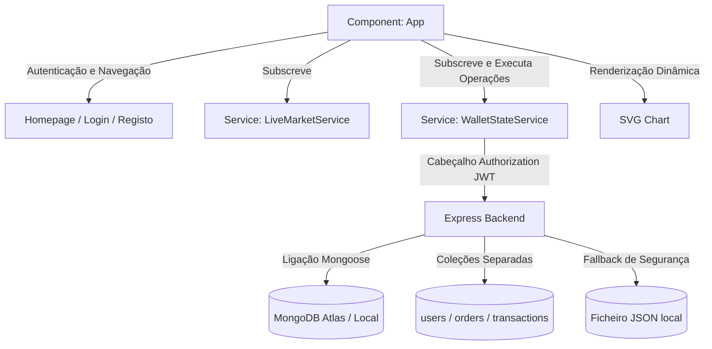

# Relatório Técnico do Projeto: Simulador de Negociação e Carteira Simão's Broker

Este documento apresenta uma descrição formal e detalhada do desenvolvimento, arquitetura, design e modelos matemáticos do **Simão's Broker**, um simulador de negociação de ativos financeiros (ações e criptomoedas) desenvolvido com o ecossistema moderno do **Angular** (versão 21).

---

## 1. Introdução e Visão Geral do Sistema

O **Simão's Broker** é uma aplicação web interativa projetada para simular um ambiente real de negociação de ativos em tempo real, inspirando-se em plataformas líderes de mercado como Binance, Coinbase e XTB.

O objetivo do sistema é permitir que os utilizadores compreendam e experimentem dinâmicas de negociação financeira, incluindo:
* Acompanhamento de cotações em tempo real com gráficos interativos.
* Execução simulada de ordens de compra e venda.
* Gestão de carteira com base no cálculo do **Preço Médio de Compra**.
* Configuração e ativação automática de ordens limite de proteção e lucro (**Stop Loss** e **Take Profit**).

A interface adota um estilo estético *dark mode glassmorphism*, proporcionando uma experiência imersiva e de elevada qualidade visual.

---

## 2. Arquitetura do Sistema e Padrões de Projeto

A aplicação adota uma arquitetura cliente-servidor distribuída e segura. O **Frontend** desenvolvido em Angular 21 comunica de forma assíncrona com o **Backend** Express, enviando tokens JWT para autenticar cada pedido. O backend, por sua vez, assegura a persistência isolada por utilizador no **MongoDB Atlas** (ou em fallback local JSON).



### 2.1. Serviços, Gestão de Estado e Backend API
O estado da aplicação no Frontend está centralizado em serviços injetáveis (`@Injectable`), utilizando **BehaviorSubjects** do RxJS para manter fluxos de dados reativos integrados com pedidos HTTP assíncronos (`HttpClient`).

1. **[live-market.service.ts](file:///c:/Users/Huawei/OneDrive/Ambiente%20de%20Trabalho/TP3/portfolio-app/src/app/services/live-market.service.ts)**:
   * Controla a simulação de preços dos ativos através de um mecanismo de passeio aleatório geométrico a cada 2 segundos.
2. **[wallet-state.service.ts](file:///c:/Users/Huawei/OneDrive/Ambiente%20de%20Trabalho/TP3/portfolio-app/src/app/services/wallet-state.service.ts)**:
   * Gere o estado da sessão (utilizador atual e token JWT) e efetua pedidos GET/POST autenticados à API.
   * Centraliza os fluxos de dados reativos de carteira (`holdings$`), saldo (`cash$`), transações confirmadas (`transactions$`) e historial geral de ordens (`orders$`).
3. **Servidor Backend Express (`portfolio-backend`)**:
   * Desenvolvido em **Node.js** com **Express** e **Mongoose**.
   * Controla o registo e autenticação de utilizadores. A segurança é assegurada pela encriptação de palavras-passe com **bcryptjs** no registo, e pela geração de **JWT (JSON Web Tokens)** assinados com validade de 24h no login.
   * Implementa a **separação lógica e física na base de dados**: a coleção `orders` armazena o historial completo de todas as ordens efetuadas (Pendentes, Executadas e Canceladas), enquanto a coleção `transactions` armazena exclusivamente as execuções confirmadas de troca financeira.
   * Possui um **modo de fallback baseado em ficheiro JSON local** (`database-fallback.json`) caso a base de dados em nuvem esteja indisponível, garantindo resiliência.

### 2.2. Reatividade da Interface com Signals
No componente principal **[app.ts](file:///c:/Users/Huawei/OneDrive/Ambiente%20de%20Trabalho/TP3/portfolio-app/src/app/app.ts)**, a reatividade moderna do Angular é implementada através de **Signals** (`signal` e `computed`).
Os fluxos assíncronos dos serviços são subscritos no gancho de ciclo de vida `ngOnInit` e os seus valores são repassados aos respetivos Signals da vista. Isto garante que a interface seja atualizada de forma granular e otimizada sempre que há alterações nos dados, evitando verificações desnecessárias de deteção de alterações (*Change Detection*).

---

## 3. Modelos Matemáticos e Algoritmos

### 3.1. Cálculo do Preço Médio de Compra (Average Purchase Price)
Para refletir fielmente a gestão de portfólio de plataformas reais, o sistema utiliza o método do **Custo Médio Ponderado** para atualizar a base de custo dos ativos adquiridos. 

* **Regra de Atualização (Compras)**:
  Sempre que um ativo é comprado, o preço médio de compra ($P_{médio}$) é recalculado utilizando a fórmula:
  $$P_{médio} = \frac{(Q_{atual} \times P_{médio\_atual}) + (Q_{nova} \times P_{execução})}{Q_{atual} + Q_{nova}}$$
  Onde:
  * $Q_{atual}$ = Quantidade atualmente detida em carteira.
  * $P_{médio\_atual}$ = Preço médio de compra antes da nova transação.
  * $Q_{nova}$ = Quantidade adquirida na nova transação.
  * $P_{execução}$ = Preço por unidade pago na nova transação.

* **Regra de Vendas**:
  A venda parcial ou total de um ativo **não altera** o preço médio de compra das unidades restantes. Apenas a quantidade detida em carteira é reduzida:
  $$Q_{final} = Q_{atual} - Q_{vendida}$$
  Isso permite calcular com precisão o lucro ou prejuízo realizado no momento da venda (diferença entre o preço de venda e o preço médio de custo).

### 3.2. Simulação de Preços (Random Walk / Passeio Aleatório)
Para simular o comportamento de mercado na ausência de uma API ativa com subscrição via WebSocket, foi implementado um algoritmo de **Passeio Aleatório Geométrico** no `LiveMarketService`:
$$P_{t} = P_{t-1} \times (1 + \Delta)$$
Onde o retorno percentual $\Delta$ é gerado aleatoriamente a cada 2 segundos no intervalo:
$$\Delta \in \left[-\frac{\sigma}{2}, \frac{\sigma}{2}\right]$$
A volatilidade $\sigma$ está configurada com base na categoria do ativo:
* **Criptomoedas (BTC, ETH)**: $\sigma = 1.6\%$ (maior volatilidade).
* **Ações (MSFT, TSLA, AAPL, NVDA)**: $\sigma = 0.6\%$ (menor volatilidade).

### 3.3. Algoritmo de Ordens Automáticas (Stop Loss & Take Profit)
O `WalletStateService` escuta ativamente o fluxo de dados de preços. A cada *tick* do mercado (2 segundos), o serviço executa uma varredura nas ordens limite ativas:

1. **Stop Loss (SL)**: Ativa-se quando o preço de mercado cai para um valor igual ou inferior ao limiar definido pelo utilizador ($P_{mercado} \le P_{SL}$).
2. **Take Profit (TP)**: Ativa-se quando o preço de mercado sobe para um valor igual ou superior ao limiar definido ($P_{mercado} \ge P_{TP}$).

Ao cumprir a condição, a ordem é executada imediatamente:
* É realizada uma venda de mercado da quantidade configurada.
* O caixa é incrementado com o valor arrecadado ($Q \times P_{mercado}$).
* A ordem é removida da lista de pendentes.
* É emitida uma notificação de alerta (*Toast*) com o tipo `warning` para informar o utilizador.
* Se a quantidade vendida esvaziar a posição no ativo, todas as outras ordens automáticas associadas a esse ativo são limpas.

### 3.4. Projeção Gráfica SVG (Mapping de Coordenadas)
Os gráficos lineares de preços são renderizados utilizando o elemento `<svg>` nativo para maximizar a performance e flexibilidade visual. 
Para converter os valores monetários reais em coordenadas de pixéis do SVG, o componente `App` calcula dinamicamente o mapeamento de coordenadas utilizando as seguintes equações de transformação:

Seja um histórico de preços $H = [p_0, p_1, \dots, p_{n-1}]$ de tamanho $n=30$.
O espaço de renderização do SVG possui largura $W = 600$, altura $H_{svg} = 220$ e margem interior $padding = 15$.

* **Coordenada X (Tempo)** para o índice $i \in [0, n-1]$:
  $$x_i = \frac{i}{n - 1} \times (W - 2 \times padding) + padding$$

* **Coordenada Y (Preço)** para um preço $p$:
  $$y(p) = H_{svg} - padding - \left(\frac{p - p_{min}}{p_{max} - p_{min}}\right) \times (H_{svg} - 2 \times padding)$$
  Onde $p_{min} = \min(H)$ e $p_{max} = \max(H)$. Se $p_{max} - p_{min} = 0$, define-se a diferença como $1$ para evitar divisão por zero.

Estas transformações de coordenadas também são aplicadas para desenhar as linhas horizontais pontilhadas das ordens de Stop Loss e Take Profit diretamente no plano do gráfico, fornecendo um feedback visual de nível profissional.

---

## 4. Estrutura de Ficheiros do Projeto

O repositório está organizado em duas partes principais (Frontend Angular e Backend Express):

### 4.1. Frontend (`portfolio-app/`)
* **[app.config.ts](file:///c:/Users/Huawei/OneDrive/Ambiente%20de%20Trabalho/TP3/portfolio-app/src/app/app.config.ts)**: Configurações da aplicação Angular, incluindo o registo do fornecedor global do HttpClient (`provideHttpClient()`) para efetuar os pedidos REST ao Express.
* **[live-market.service.ts](file:///c:/Users/Huawei/OneDrive/Ambiente%20de%20Trabalho/TP3/portfolio-app/src/app/services/live-market.service.ts)**: Serviço de simulação das cotações e de cache temporal dos ticks históricos.
* **[wallet-state.service.ts](file:///c:/Users/Huawei/OneDrive/Ambiente%20de%20Trabalho/TP3/portfolio-app/src/app/services/wallet-state.service.ts)**: Comunica diretamente com a API do Express via pedidos GET/POST para sincronizar o saldo, carteira, transações e limites automáticos.
* **[app.ts](file:///c:/Users/Huawei/OneDrive/Ambiente%20de%20Trabalho/TP3/portfolio-app/src/app/app.ts)**: Controlador raiz que mapeia os fluxos do backend para Signals locais do Angular, gere abas e renderiza o gráfico SVG.
* **[app.component.html](file:///c:/Users/Huawei/OneDrive/Ambiente%20de%20Trabalho/TP3/portfolio-app/src/app/app.component.html)**: Vista HTML contendo os painéis do terminal de trading, carteira de ativos, ordens ativas e painel histórico.

### 4.2. Backend (`portfolio-backend/`)
* **[package.json](file:///c:/Users/Huawei/OneDrive/Ambiente%20de%20Trabalho/TP3/portfolio-backend/package.json)**: Dependências do backend (Express para servidor API, Mongoose para ORM do MongoDB, Cors para requisições cross-origin, Dotenv para variáveis de ambiente, bcryptjs para encriptação de senhas e jsonwebtoken para tokens JWT).
* **[server.js](file:///c:/Users/Huawei/OneDrive/Ambiente%20de%20Trabalho/TP3/portfolio-backend/server.js)**: Código central do backend Express. Define os modelos de dados (User, Order, Transaction), encriptação bcrypt, middleware JWT de validação de rota, endpoints de login e registo, lógica de compra, venda, reset e disparo de limites (separando ordens gerais de transações confirmadas), e o fallback local JSON.
* **[.env](file:///c:/Users/Huawei/OneDrive/Ambiente%20de%20Trabalho/TP3/portfolio-backend/.env)**: Variáveis de ambiente contendo a porta do servidor, a URI de ligação do MongoDB Atlas e a chave secreta JWT (`JWT_SECRET`).

---

## 5. Instruções de Instalação e Execução

### Pré-requisitos
* **Node.js** (versão 18 ou superior) instalado.
* **MongoDB** (opcional, pode ser uma instância local a correr no porto 27017, um Cluster do MongoDB Atlas ou pode usar o fallback integrado por ficheiro JSON).

### Passo 1: Configuração e Execução do Backend
1. Navegue até à pasta do backend e instale as dependências:
   ```bash
   cd portfolio-backend
   npm install
   ```
2. Crie ou edite o ficheiro `.env` na raiz do diretório `portfolio-backend` com a sua string de ligação do MongoDB Atlas:
   ```env
   PORT=3000
   MONGODB_URI=mongodb+srv://<usuario>:<senha>@cluster0.xxxxx.mongodb.net/simao-broker?retryWrites=true&w=majority
   JWT_SECRET=simao_broker_super_secret_jwt_key_987
   ```
   *(Nota: Se deixar a URI padrão ou se não tiver o MongoDB a correr, o servidor iniciará de imediato no modo de fallback usando o ficheiro `database-fallback.json` local).*
3. Inicie o servidor Express:
   ```bash
   npm start
   ```
   O servidor backend ficará ativo em [http://localhost:3000](http://localhost:3000).

### Passo 2: Configuração e Execução do Frontend Angular
1. Noutra janela do terminal, aceda à pasta do frontend e instale as dependências:
   ```bash
   cd portfolio-app
   npm install
   ```
2. Inicie o servidor de desenvolvimento do Angular:
   ```bash
   npm start
   ```
   A aplicação compilará e estará acessível em: [http://localhost:4200](http://localhost:4200).

### Passo 3: Compilar o Frontend para Produção (Opcional)
Para compilar e otimizar os ficheiros do frontend para distribuição na pasta `dist/`:
```bash
npm run build
```

---

## 6. Conclusão

O projeto atende com rigor aos requisitos técnicos de programação modular, gestão reativa de estado através de Angular Signals e RxJS Observables, além de implementar regras financeiras formais de cálculo de custo médio e automatização de ordens limite. A interface limpa, dinâmica e responsiva garante uma simulação fluida e cativante para qualquer utilizador.
